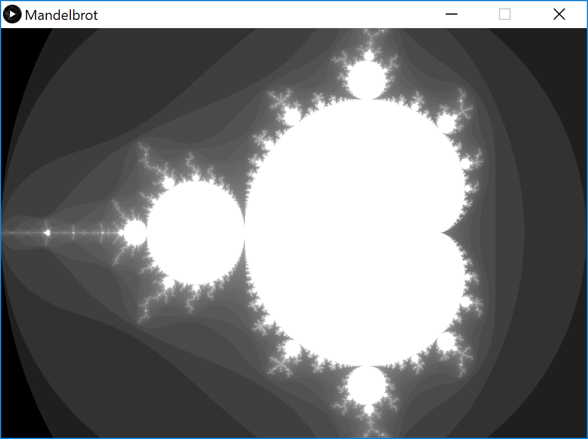

# Mandelbrot-Set
Uses Processing to render the [Mandelbrot Set](https://en.wikipedia.org/wiki/Mandelbrot_set). It is a famous fractal that is present on the complex plane.

## Requirements

* Processing (version 3 or newer)

## Installing

Simply open "Mandelbrot.pde" in the "Mandelbrot" folder through Processing and run.

## Instructions

This program renders the Mandelbrot set by using a large amount of ellipses. You can change the resolution by adjusting `size(x, y)` in `setup()`. To change the actual render detail, decrease the variable `incrementX` in `setup()`, the smaller the value, the more clear the picture. Note that as `incrementX` decreases, the render time increases exponentially, so do be patient.

## Screenshots

## Built With

* Processing

## Author(s)

* Bob Huang
